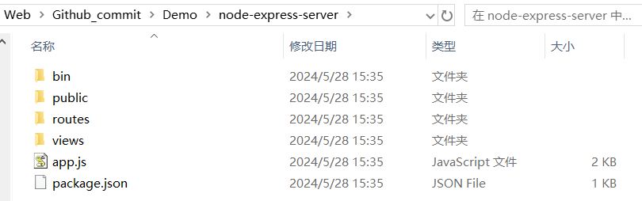
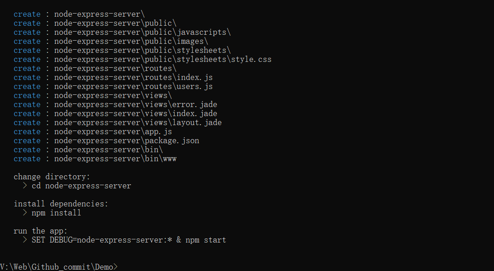
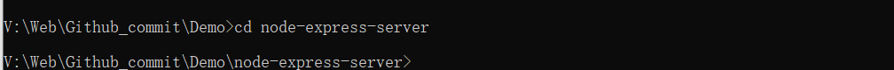
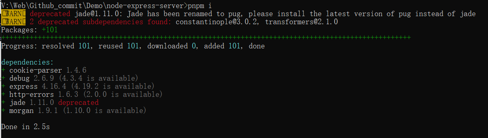
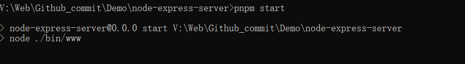
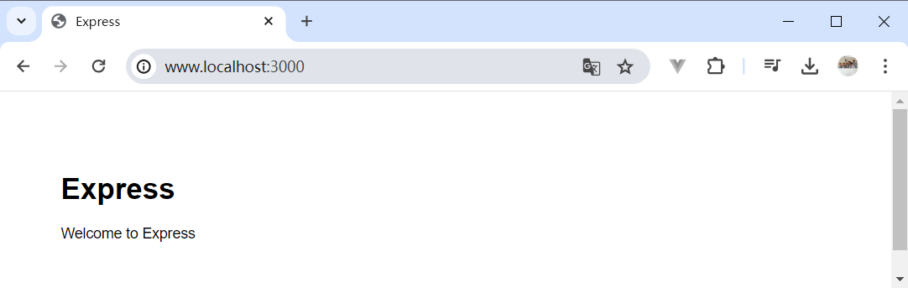
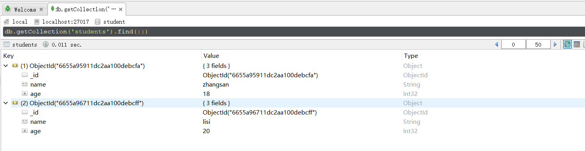
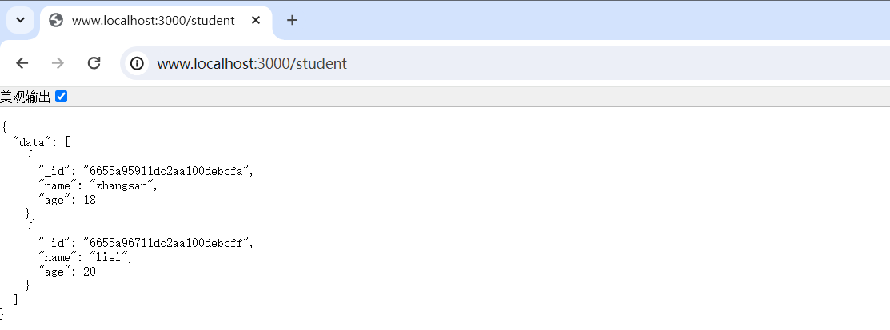

# node-express骨架搭建

## 安装 express-generator 构建工具

```
npm install -g express-generator 
```

## 新建express项目

打开cmd或者powershell或者vscode终端

```
express node-express-server // node-express-server是项目名
```

会在当前路径下创建一个名为node-express-server的文件夹



## 安装依赖 并启动项目

输入了 ```express node-express-server``` 之后，命令行会有提示，跟着执行完就可以。



- ① ```cd node-express-server``` 进入该路径



- ② 安装依赖 ```pnpm i``` 



这里用 ```npm i ``` 也可以，但是我觉得太慢了，就用pnpm，没有pnpm的可以 ```npm i -g pnpm``` 安装pnpm指令。

- ③ ```pnpm start```运行项目



此时项目启动

- ④ 在网址中输入 http://www.localhost:3000/ 就可以访问到了



# mongodb

## mongoose

- ① 导入 mongoose 包```pnpm i mongoose```
- ② 使用mongoose连接mongo数据库 

>  在根目录下创建了 /config/db.config.js 

```javascript
//使用mongoose包
const mongoose = require('mongoose')

//协议名称+IP地址+mongodb默认端口号+数据库名称
//如果没找到会新建student
mongoose.connect('mongodb://127.0.0.1:27017/student')

const conn = mongoose.connection

conn.on("open", () => {
    console.log("数据库连接ok");
})

conn.on("error", (err) => {
    console.log(err);
})

module.exports = mongoose
```

- ③ 创建schema

> 在根目录下创建了 /models/student.js

```javascript
const mongoose = require('../config/db.config')

const Schema = mongoose.Schema

const stuType = {
  name: String,
  age: Number
}
const stuModel = mongoose.model('student',new Schema(stuType))

module.exports = stuModel
```

- ④ /routes/student.js  : 定义当用户请求 /student的时候后端进行什么数据操作

```javascript
let express = require('express');
let router = express.Router();
let stuModel = require('../models/student')

router.get('/', async function(req, res, next) {
  res.send({
    data: await stuModel.find({})
  });
});

module.exports = router;
```

- ⑤ app.js中注册路由

```javascript
var studentRouter = require('./routes/student');
// var app = express();
app.use('/student', studentRouter);
```

- ⑥ app.js中引入连接数据库的js文件

```javascript
//引入 连接数据库的JS
require('./config/db.config');
```

- ⑦用ROBO 3T在数据库中手动添加数据



# 效果

启动mongodb数据库 ->启动express项目 

www.localhost:3000/student 显示如下：



